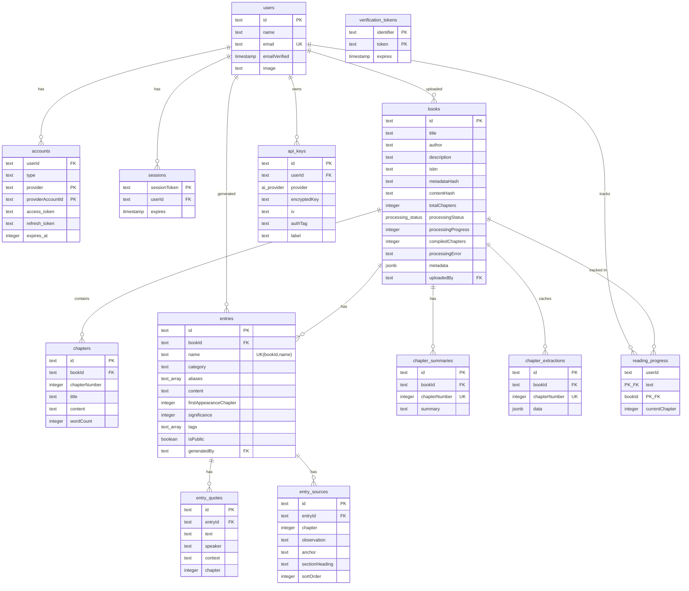
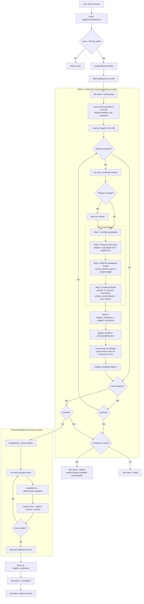
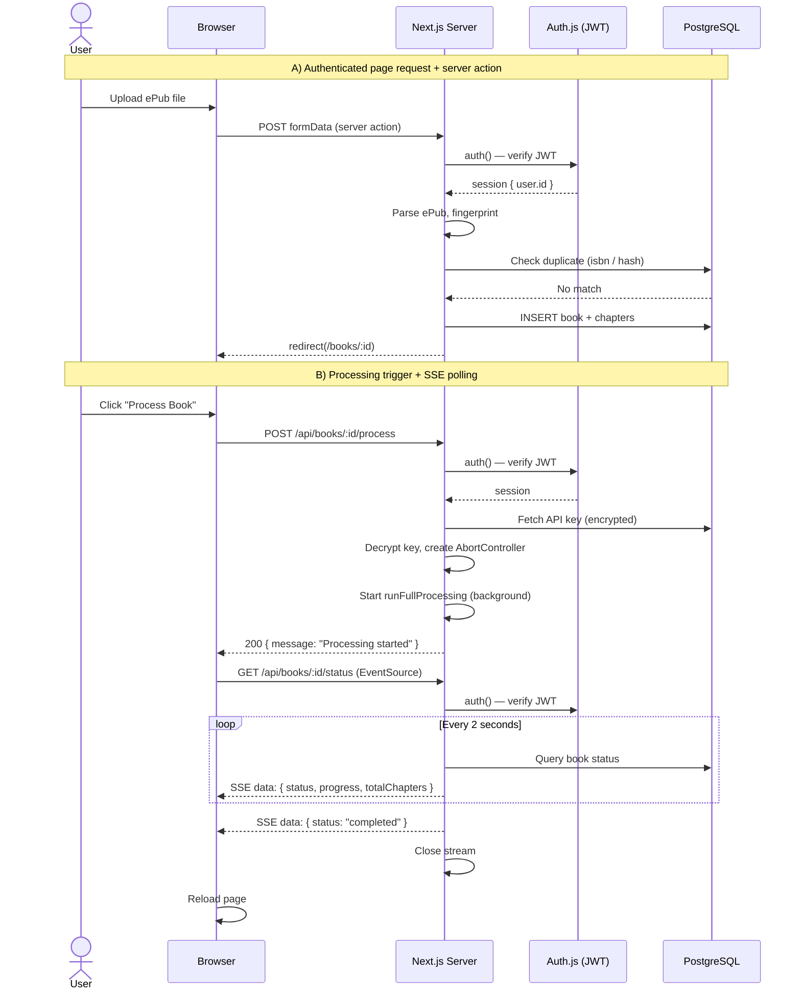
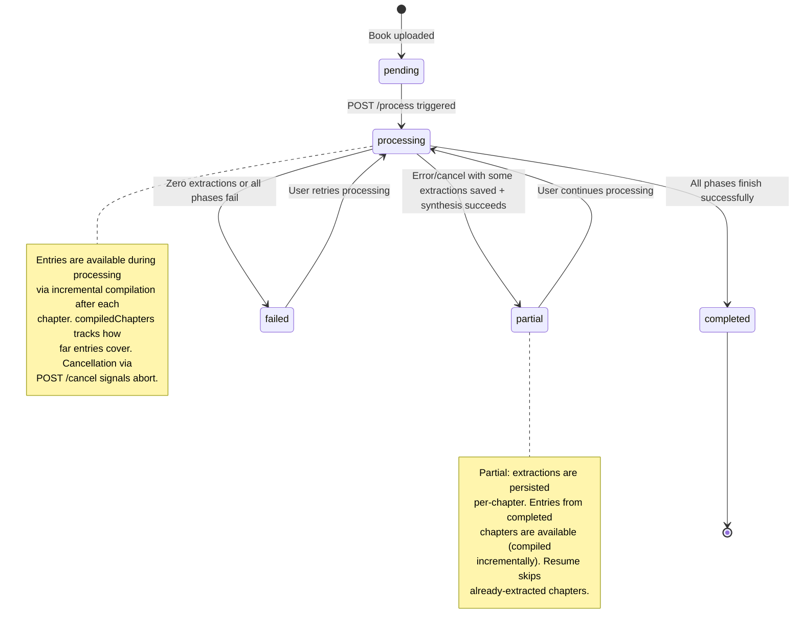

# Chronicle Architecture

Chronicle is a progress-locked reading companion that processes ePub books through an AI pipeline, producing encyclopedia-style entries (characters, locations, themes, etc.) that are filtered by how far the reader has progressed. This document provides visual diagrams of the system's architecture.

---

## Database Schema

The database has 11 tables split across four domains: authentication (managed by Auth.js/Drizzle adapter), books & chapters (including incremental extraction cache), AI-generated entries with supporting data, and user state (reading progress & API keys). All foreign keys cascade on delete from their parent.

---

## Book Processing Pipeline

When a user triggers processing, the system runs an incremental pipeline in the background. An `AbortController` allows cancellation at any checkpoint. Large chapters are automatically split into chunks. Extraction uses a two-step approach: structure discovery identifies subjects and paragraph references, then detail extraction runs in parallel batches grouped by paragraph locality (subjects referencing nearby text share a batch, eliminating duplicate input tokens). Detail extraction produces typed content blocks (summary, observation, quote, appearance) and receives previous blocks for incremental context. Compilation is a deterministic template — no AI call needed.

**Incremental compilation**: After each chapter's extraction, compilation runs on all extractions so far using upserts (`onConflictDoUpdate` on `entries(bookId, name)`). This makes entries available to users immediately — they can browse the Codex and read entries while processing continues. The chapter selector limits selection to compiled chapters. A final compilation after the loop ensures consistency.

**Incremental persistence**: Each chapter's extraction result is saved to `chapter_extractions` immediately after completion. On resume, previously extracted chapters are loaded and skipped. On error/cancel with partial extractions, entries from incremental compilation are already available and status is set to `"partial"`. Saved extractions are cleaned up after successful full completion.

---

## Request Flow

Two key request patterns: (A) a standard authenticated page load with server action, and (B) the processing trigger followed by SSE status polling.

---

## Processing State Machine

The `processingStatus` column on the `books` table tracks the lifecycle of AI processing. The enum has five values with the following transitions:

---

## Module Structure

High-level view of how the source directories relate to each other. Arrows indicate dependency direction (imports).

