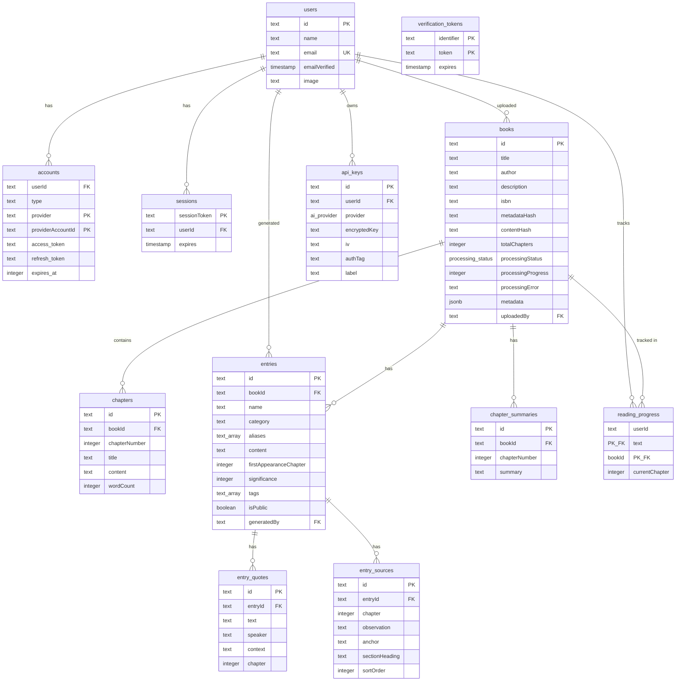
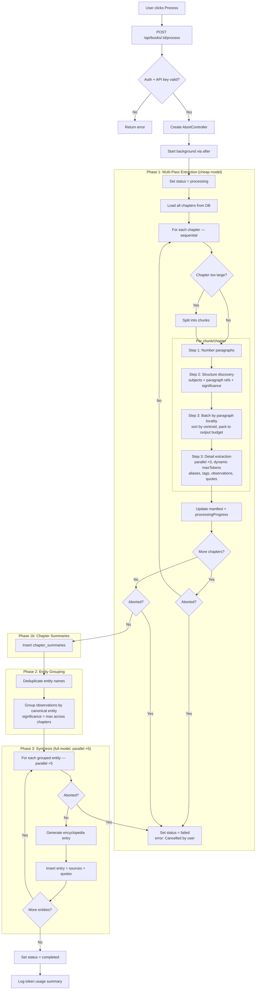
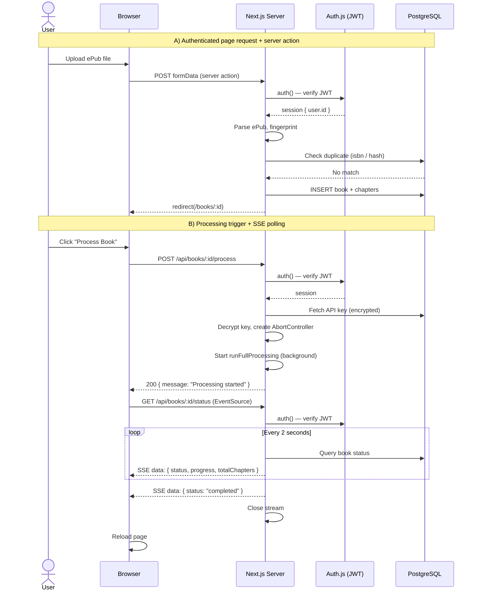
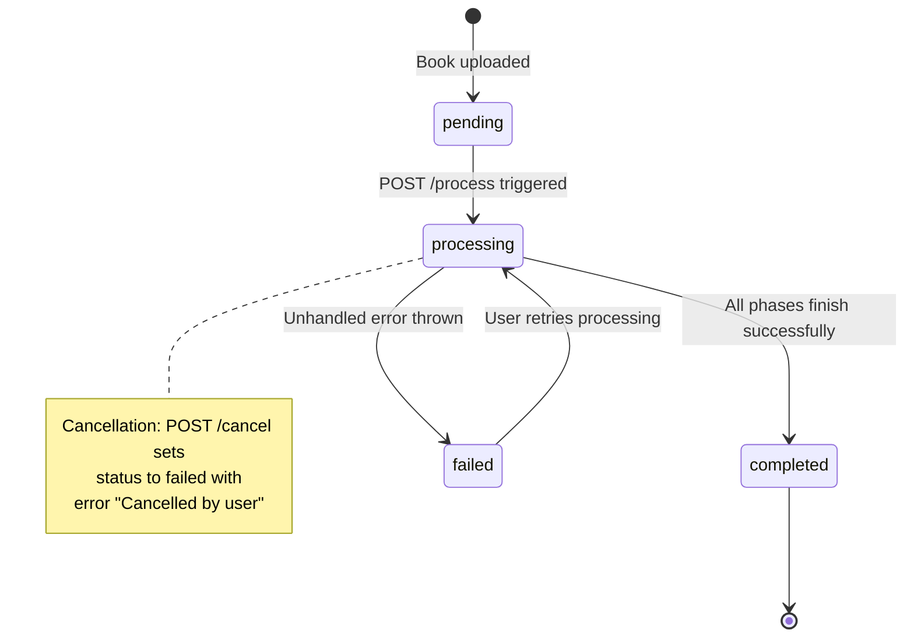
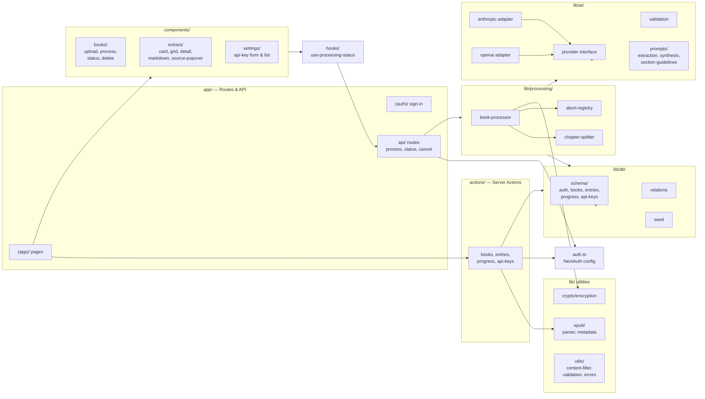

# Chronicle Architecture

Chronicle is a progress-locked reading companion that processes ePub books through an AI pipeline, producing encyclopedia-style entries (characters, locations, themes, etc.) that are filtered by how far the reader has progressed. This document provides visual diagrams of the system's architecture.

---

## Database Schema

The database has 10 tables split across four domains: authentication (managed by Auth.js/Drizzle adapter), books & chapters, AI-generated entries with supporting data, and user state (reading progress & API keys). All foreign keys cascade on delete from their parent.

---

## Book Processing Pipeline

When a user triggers processing, the system runs a multi-phase pipeline in the background. An `AbortController` allows cancellation at any checkpoint. Large chapters are automatically split into chunks. Extraction uses a two-step approach: structure discovery identifies subjects and paragraph references, then detail extraction runs in parallel batches grouped by paragraph locality (subjects referencing nearby text share a batch, eliminating duplicate input tokens). Synthesis also runs in parallel (5 concurrent).

---

## Request Flow

Two key request patterns: (A) a standard authenticated page load with server action, and (B) the processing trigger followed by SSE status polling.

---

## Processing State Machine

The `processingStatus` column on the `books` table tracks the lifecycle of AI processing. The enum has four values with the following transitions:

---

## Module Structure

High-level view of how the source directories relate to each other. Arrows indicate dependency direction (imports).

